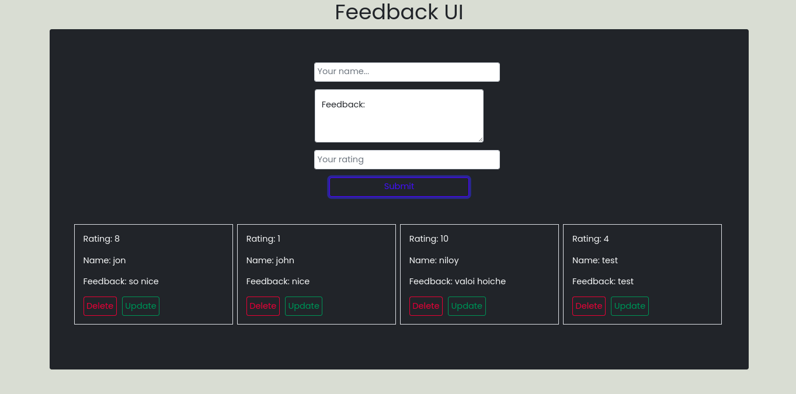

```
Simple feedback site using React, Node, Express And Mysql. Don't need to refresh when data add, delete or update.

First clone then:

npm install

npm start //for client

npm run start-dev //for server
```


